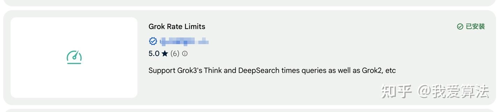
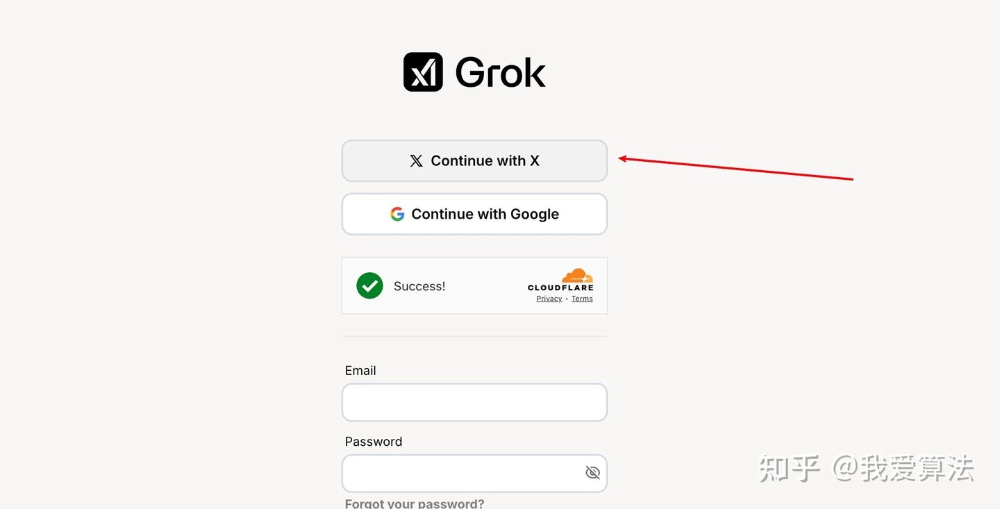
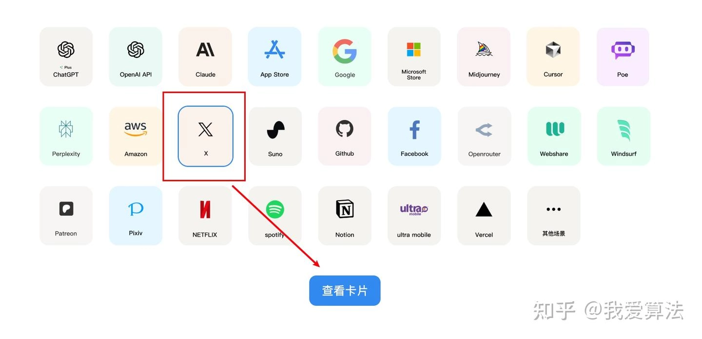
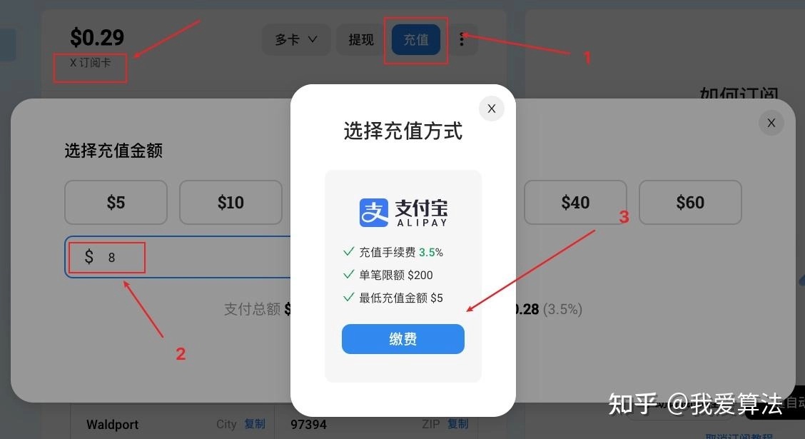
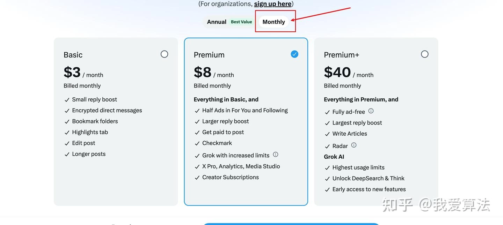
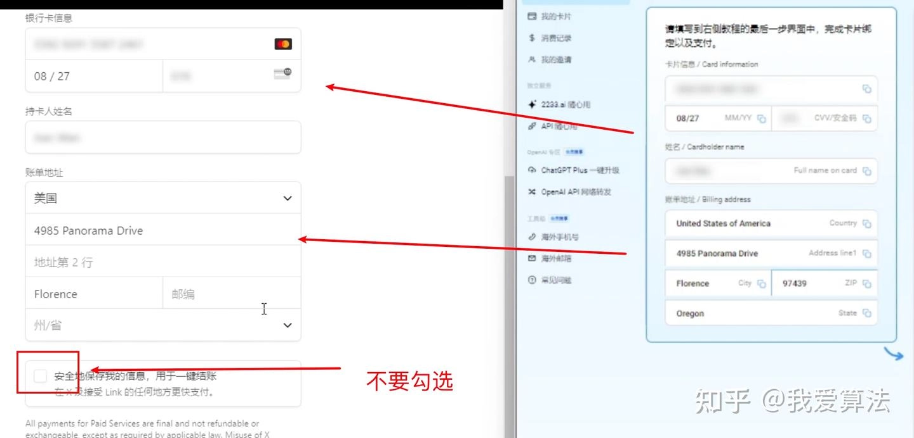
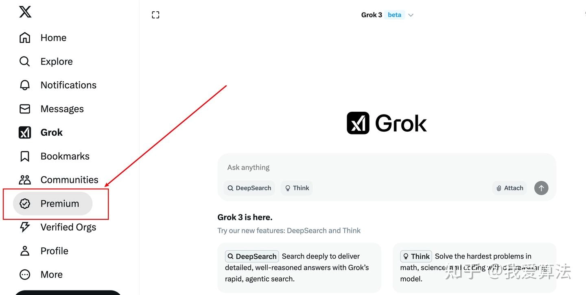
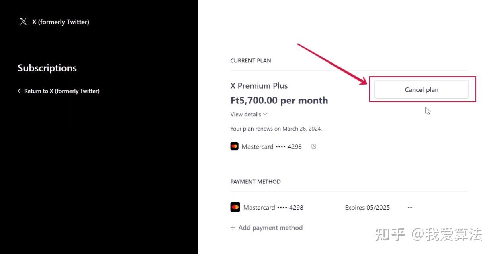
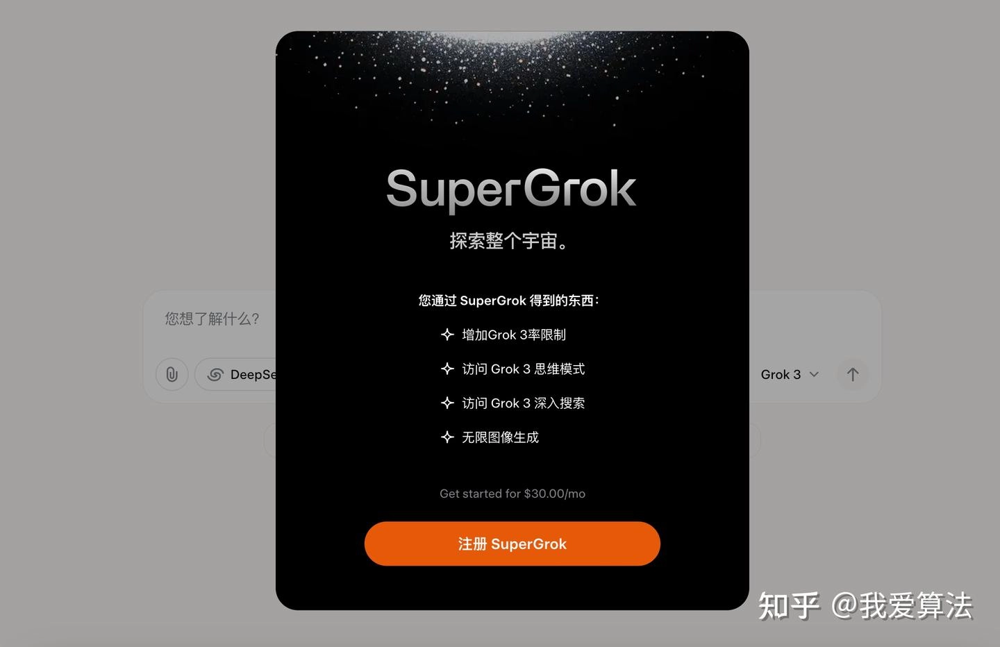
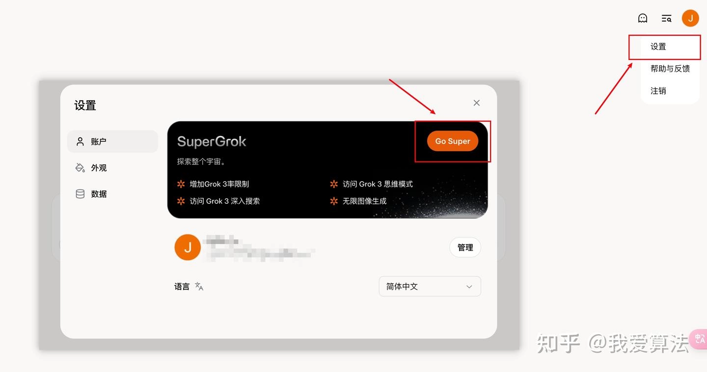

# Grok3高级功能使用次数全解析：如何选择最划算的订阅方案

Grok3已经正式向所有用户开放，但你知道吗？不同账号类型在使用高级推理和深度搜索功能时，次数限制可是天差地别。免费账号24小时只能用10次推理功能，Premium账号2小时就能用20次，而SuperGrok更是达到30次。这些差异直接影响你的使用体验和工作效率。

今天就来聊聊Grok3各类账号的真实使用次数，以及如何用最省钱的方式提升你的调用额度。测试过多个账号类型后，我发现了一个让人意外的结论——最贵的不一定最划算。

---

## 四种账号类型的次数对比

Grok3目前提供四种账号类型，每种对应不同的使用次数：

**免费账号**：普通模型20次/2小时，推理和深度搜索10次/24小时  
**SuperGrok**：普通模型100次/2小时，推理和深度搜索30次/2小时  
**Premium**：普通模型50次/2小时，推理和深度搜索20次/2小时  
**Premium+**：普通模型100次/2小时，推理和深度搜索30次/2小时

这些数据是通过Chrome扩展程序"Grok Rate Limits"查询到的。这个插件特别实用，不仅能实时显示剩余次数，还会在本地记录上次调用时间，方便你规划使用节奏。

对比下来会发现：**Premium的性价比最高**。它只要8美元/月，推理次数就能达到20次/2小时，已经够大多数人日常使用。而SuperGrok虽然次数更多，但价格也贵不少。

## 两个独立的账号体系

这里有个容易混淆的地方：Grok3支持两种登录方式——邮箱账号和X账号（原推特）。关键是，**这两种方式登录后是完全独立的账号体系**，互不相通。

因为Grok和X都是马斯克的产业，所以在Grok官网可以直接用X账号登录。如果你在X平台订阅了Premium，用X账号登录Grok就能直接享受对应权益。如果你想扩大使用额度，👉 [订阅Grok Super会员一个月成品号（质保30天）](https://shaoyumi.com/buy/66)是个省心的选择，开箱即用，不用折腾各种支付和网络问题。

另外，Grok3的次数限制一直在动态调整，所以建议安装那个Chrome插件，随时查看最新情况，再决定要不要升级订阅计划。

## Premium订阅教程（推荐）

Premium是X平台上的订阅计划，也就是小蓝V标识。订阅后不仅能在X平台免广告，还能在Grok3享受20次/2小时的高级推理额度。

**第一步：注册X账号**

如果你还没有X账号，用谷歌邮箱就能注册。直接访问x.com，按提示填写信息即可。

**第二步：准备虚拟Master卡**

国内用户订阅Premium最大的障碍是支付问题。X平台只接受Visa或Master卡，而国内发行的信用卡大多不支持。

这时可以申请一张虚拟Master卡解决。这种卡是虚拟的，专门用于国际订阅，不用担心盗刷风险。只需要充值8美元就够订阅Premium，用不完的余额随时可以提现。

**第三步：在X平台订阅Premium**

打开Premium订阅页面（x.com/i/premium_sign_up），选择Premium计划，用刚才的虚拟卡信息完成支付。

**注意**：绑卡时如果被拒绝，大概率是网络环境问题。建议使用稳定的代理，避免频繁切换IP。

**第四步：取消自动续订**

订阅成功后，如果你不想下个月继续扣费，记得立即取消自动续订。在X平台找到Premium的Manage入口，点击取消续订即可。这样你这个月还能正常使用，但下个月不会自动扣款。

**第五步：用X账号登录Grok**

订阅完成后，打开Grok官网（grok.com），选择"用X账号登录"，你的次数就会自动刷新到Premium标准。用Grok Rate Limits插件查询一下，就能看到新的额度。

## SuperGrok订阅教程

如果你需要更高的使用频率，或者想体验无限绘画和高级语音功能，SuperGrok是更好的选择。它的订阅流程和Premium类似，但是在Grok官网直接完成。

**注意**：一定要用网页版订阅，不要用手机App。苹果App Store会额外收取30%的"苹果税"，非常不划算。

打开Grok官网，正常情况下会自动弹出SuperGrok的介绍。如果没有弹出，在网址后面加上参数`?show_subscribe=1`，完整链接是：grok.com?show_subscribe=1

订阅SuperGrok同样需要虚拟Master卡。准备好卡信息后，在Grok网页版找到"设置"，点击"Go Super"，按提示完成支付就行。

如果你觉得这些步骤太繁琐，或者担心支付环节出问题，👉 [直接购买Grok Super会员一个月成品号（质保30天）](https://shaoyumi.com/buy/66)会更省心。成品号已经完成订阅，收到就能用，不用自己折腾支付和网络问题。

---

## 使用体验总结

用了一段时间Grok3后，感觉它在某些方面确实超过了GPT。首先是免费额度够大方，普通用户就能用20次/2小时的普通模型，对于轻度使用完全够了。其次是token上下文很长，每秒输出速度也快，处理长文本时优势明显。

在研究和写作场景，Grok3的推理功能表现不错。特别是深度搜索功能，能帮你快速汇总网络信息，节省大量查资料的时间。如果你经常需要处理复杂问题或写长文，**Premium订阅能让你的效率至少翻倍**——20次/2小时的推理额度足够应付大多数工作场景，而且每月只要8美元，性价比很高。
